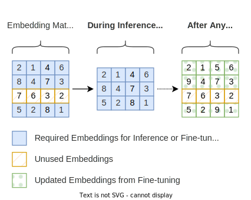

# Dynamic Embedding Pruning

<p align="center">
    
</p>

## Introduction

This repository contains the implementation for the paper [Frustratingly Simple Memory Efficiency for Pre-trained Language Models via Dynamic Embedding Pruning](https://arxiv.org/abs/2309.08708).

Dynamic Embedding Pruning is a simple technique that can reduce the memory footprint of pre-trained language models without impacting performance.

## Installation

```
pip install git+https://github.com/mlsw/dynamic-embedding-pruning.git
```

## Usage

### Hugging Face Transformers

There is a high-level API for Hugging Face Transformers PyTorch models via the [`HFEmbeddingPruner`](src/dynamic_embedding_pruning/hf_embedding_pruner.py) class. 

```python
from dynamic_embedding_pruning import HFEmbeddingPruner

embedding_pruner = HFEmbeddingPruner(model)
dataset, _ = embedding_pruner.prepare_model(tokenizer, dataset)
```

Please see [examples/distilbert_sst2.py](examples/distilbert_sst2.py) for a complete example. Additionally, the scripts in the [utils](utils) directory show how to use this API with the Hugging Face Transformers [Trainer](https://huggingface.co/docs/transformers/main_classes/trainer).

### PyTorch

Alternatively, the [`EmbeddingPruner`](src/dynamic_embedding_pruning/embedding_pruner.py) class can be used directly for PyTorch models. Please see [`HFEmbeddingPruner`](src/dynamic_embedding_pruning/hf_embedding_pruner.py) for an example of how to use this.

## Reproducibility

The following scripts can be used to reproduce the results from the paper. These are adapted from Hugging Face Transformers [PyTorch Examples](https://github.com/huggingface/transformers/tree/main/examples/pytorch) with support for Dynamic Embedding Pruning.

| Task | Script | Documentation |
| ---- | ------ | --------------|
| GLUE | [run_glue_dep.py](utils/run_glue_dep.py) | [Here](https://github.com/huggingface/transformers/tree/main/examples/pytorch/text-classification#glue-tasks) |
| SQuAD | [run_qa_dep.py](utils/run_qa_dep.py) | [Here](https://github.com/huggingface/transformers/tree/main/examples/pytorch/question-answering#question-answering) |
| XNLI | [run_xnli_dep.py](utils/run_xnli_dep.py) | [Here](https://github.com/huggingface/transformers/tree/main/examples/pytorch/text-classification#xnli) |

## License

This project is licensed under the terms of the MIT license. Please see [LICENSE](LICENSE) for more details.

## Citation

If you found this work useful, please consider citing our paper:

```bibtex
@misc{williams-aletras-2023-frustratingly,
  title={Frustratingly Simple Memory Efficiency for Pre-trained Language Models via Dynamic Embedding Pruning}, 
  author={Miles Williams and Nikolaos Aletras},
  year={2023},
  eprint={2309.08708},
  archivePrefix={arXiv},
  primaryClass={cs.CL},
  url={https://arxiv.org/abs/2309.08708}
}
```
